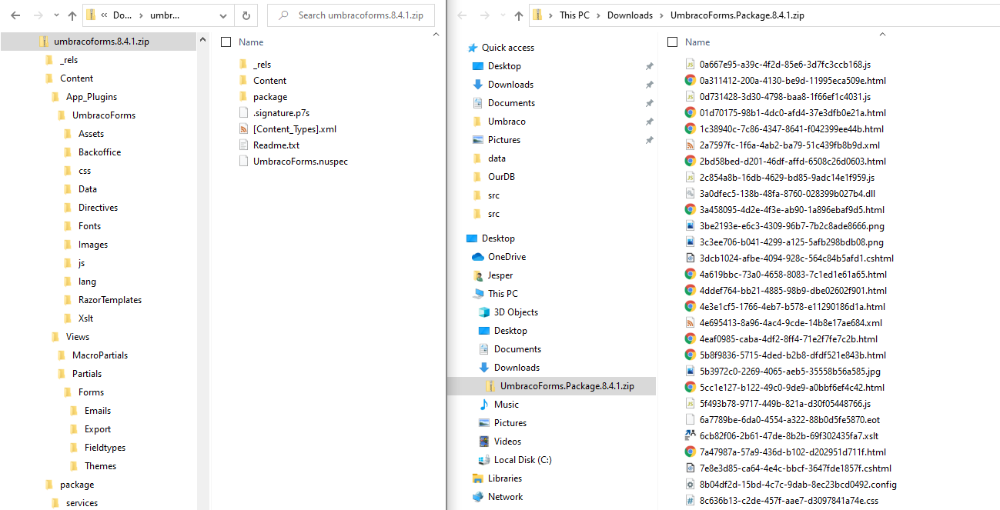

# Switching to the NuGet package format

Request for Contribution (RFC) 0024 : _Switching to the NuGet package format_

## Code of conduct

Please read and respect the [RFC Code of Conduct](https://github.com/umbraco/rfcs/blob/master/CODE_OF_CONDUCT.md)

## Intended Audience

The intended audience for this RFC is: Package developers and consumers.

## Summary

As mentioned in the [parent RFC](0018-package-format.md), we have a goal to update the Umbraco package format. One of the things we want to do to improve it is to get away from our own package format and use NuGet instead. This will bring many benefits, mainly proper dependency tracking & a single package format to maintain.

## Motivation

We want to make it simpler for package developers to create and maintain their packages. We also want to make it safer for package consumers to install packages.

## Detailed Design

As there are a lot of features to cover we have some suggested milestones below:

### Milestone 1: NuGetify the Umbraco zip structure

_This milestone can be completed on **Umbraco 8**_

The first step towards accepting NuGet packages in Umbraco would be to allow both the standard Umbraco zip and a NuGet package to work when installed in the backoffice.
To get that process started we can start by making their structures more similar. If you compare a NuGet file structure with a zip one you will see that NuGet properly nests files in folders as they are expected to be once installed. The Umbraco zip has a flat structure and a manifest file (package.xml) that keeps track of paths:



Moving all files in the Umbraco zip into a "Content" folder as it is in NuGet will also help make it a lot clearer for package devs and consumers what the package does!

We also suggest that we split out the schema and content parts of the package xml into seperate files. So instead of having a huge package.xml file with elements like this one:

```xml
<Macros>
    <macro>
      <name>Get Latest Blogposts</name>
      <alias>latestBlogposts</alias>
      <macroType>PartialView</macroType>
      <macroSource>~/Views/MacroPartials/LatestBlogposts.cshtml</macroSource>
      <useInEditor>True</useInEditor>
      <dontRender>False</dontRender>
      <refreshRate>0</refreshRate>
      <cacheByMember>False</cacheByMember>
      <cacheByPage>False</cacheByPage>
      <properties>
        <property name="How many posts should be shown" alias="numberOfPosts" sortOrder="0" propertyType="Umbraco.Integer" />
        <property name="Where to get blog posts from" alias="startNodeId" sortOrder="1" propertyType="Umbraco.ContentPicker" />
      </properties>
    </macro>
</Macros>
```

We could have a new "UmbracoContent" folder with folders for macroes, doc types, documents (content nodes), etc. If they all follow a standard they don't need to be referenced in the package.xml, the package installer can check if they are there, and then install them (Please check unresolved issues further down for what this means).

### Milestone 2: Accept both .zip and .nupk package installs

_This milestone can be completed on **Umbraco 8**_

When the 2 structures are more similar, we need the package installer to be able to install both types of files. At this point we are still not concerned with supporting all of the NuGet features, but rather we want to be able to install the files from both package types.

### Milestone 3: Warning about dependencies

_This milestone should be done on **[Project UniCore](https://github.com/umbraco/rfcs/blob/master/cms/0001-project-unicore-intro.md)**_

As a lot of the underlying dependencies on this feature is changing between .Net Framework and .Net Core, this milestone should be done on Project UniCore.

Now that installing NuGet packages is possible, the next step is to warn about missing and conflicting dependencies when installing. 

//TODO - how do we accomplish this?

### Milestone 4: Handling dependencies

//TODO - how do we accomplish this?

## Drawbacks

All current packages will need to be updated to work with the new format.

## Alternatives

N/A

## Out of Scope

The backoffice install / uninstall flow will be covered in a seperate RFC.
The suggested package migrations will be covered in a seperate RFC.

## Unresolved Issues

If we move all Umbraco Content out of the package.xml as suggested in Milestone 1, then we won't have a list of things to uninstall when the package is uninstalled. We are looking for feedback and ideas on this. 

## Related RFCs 

This is one of the sub RFCs of the overarching [Switching package format RFC](0018-package-format.md).

## Contributors

This RFC was compiled by:

* Jesper Mayntzhusen (Umbraco HQ)
* Shannon Deminick (Umbraco HQ)
* Dave Woestenborghs (Community member and part of the Umbraco package team)
* Kevin Jump (Community member and part of the Umbraco package team)
* Lotte Pitcher (Community member and part of the Umbraco package team)
* Nik Rimington (Community member and part of the Umbraco package team)
* Richard Ockerby (Community member and part of the Umbraco package team)
